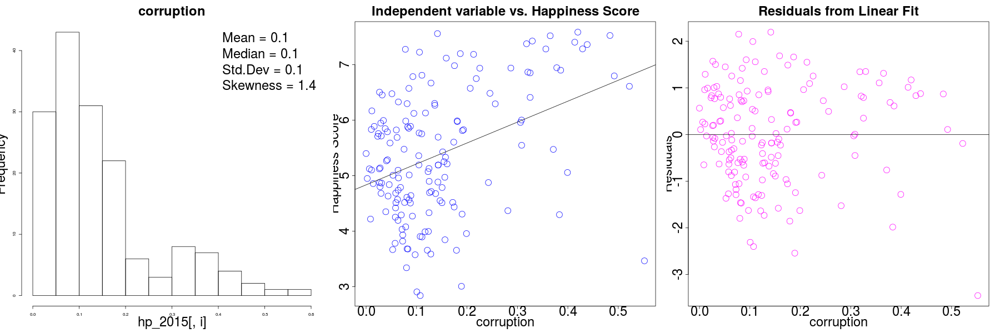

```{r setup, include=FALSE}

knitr::opts_chunk$set(echo = TRUE)

rm(list=ls())

library(ggplot2)
library(MASS)
library(car)
library(moments)
library(cowplot)
library(grid)
library(gridExtra)

home_dir <- "~/_smu/_src/happiness/"
setwd(home_dir)

data_dir <- "./data"


```

## Happiness - Regression Project -


### __Intro__  

*** 
The following __Context__ and __Content__ is from : https://www.kaggle.com/unsdsn/world-happiness  

>##### __Context__  
>The World Happiness Report is a landmark survey of the state of global happiness. The first report was published in 2012, the second in 2013, and the third in 2015. The World Happiness Report 2016 Update, which ranks 156 countries by their happiness levels, was released today in Rome in advance of __UN World Happiness Day, March 20th__.  
>Leading experts across fields – economics, psychology, survey analysis, national statistics, health, public policy and more – describe how measurements of well-being can be used effectively to assess the progress of nations. The reports review the state of happiness in the world today and show how the new science of happiness explains personal and national variations in happiness. They reflect a new worldwide demand for more attention to happiness as a criteria for government policy.  

>##### __Content__  
>The happiness scores and rankings use data from the Gallup World Poll. The scores are based on answers to the main life evaluation question asked in the poll. This question, known as the Cantril ladder, asks respondents to think of a ladder with the best possible life for them being a 10 and the worst possible life being a 0 and to rate their own current lives on that scale. The scores are from nationally representative samples for the years 2013-2015 and use the Gallup weights to make the estimates representative. The columns following the happiness score estimate the extent to which each of six factors :  
>	* economic production,  
>	* social support,  
>	* life expectancy,  
>	* freedom,  
>	* absence of corruption, and  
>	* generosity   
>– contribute to making life evaluations higher in each country than they are in Dystopia, a hypothetical country that has values equal to the world’s lowest national averages for each of the six factors. 

#### __Objective__

Within the context of __World Happiness Day__ explore the data available from the the United Nations survey and idneitfy the characteristics that are associated with higher __happiness__ scores

*** 
### __Descriptive statistics__  

*** 

### __Analysis__  

*** 

### __Interpretation__  

*** 

### __Conclusion__  

*** 


  
  
#### __Setup some data directories  

```{r read data, include = FALSE, message = FALSE}

	setwd(home_dir)
	setwd(data_dir)

	hp_2015 <- read.csv("happiness_2015.csv", stringsAsFactors = FALSE)
	setwd(home_dir)

	names(hp_2015) <- tolower(names(hp_2015))
	
	for (i in 2:(length(hp_2015)))
	{
		if (class(hp_2015[,i]) == "character")
		{
			hp_2015[,i] <- factor (hp_2015[,i])
		}
	}
```

#### __Remove extreme outliers from each column of numerical data__  

```{r remove outliers, include = FALSE, message = FALSE}

# ...	-=-=-=-=-=-=-=-=-=-=-=-=-=-=-=-=-=-=-=-=-=-=-=-=-=-=-=-=-=-=-=-=-=-=-=-=-
# ...	remove outliers ... more than 5 sigma from mean value
# ...	-=-=-=-=-=-=-=-=-=-=-=-=-=-=-=-=-=-=-=-=-=-=-=-=-=-=-=-=-=-=-=-=-=-=-=-=-
	
	lst <- length(hp_2015) - 1	# sale price is (currently) last column
	
	for (i in 2 : lst)
	{
		if(class(hp_2015[,i]) == "integer" || class(hp_2015[,i]) == "numeric")
		{
			hp_2015[,i][which(scale(hp_2015[,i]) > 5)] <- NA
			hp_2015[,i][which(scale(hp_2015[,i]) < -5)] <- NA
		}
	}

```

```{r new and scale, include = FALSE, message = FALSE}

# ...	-=-=-=-=-=-=-=-=-=-=-=-=-=-=-=-=-=-=-=-=-=-=-=-=-=-=-=-=-=-=-=-=-=-=-=-=-
# ...	create a few new columns
# ...	-=-=-=-=-=-=-=-=-=-=-=-=-=-=-=-=-=-=-=-=-=-=-=-=-=-=-=-=-=-=-=-=-=-=-=-=-

	
# ...	-=-=-=-=-=-=-=-=-=-=-=-=-=-=-=-=-=-=-=-=-=-=-=-=-=-=-=-=-=-=-=-=-=-=-=-=-
# ...	scale each column independently
# ...	-=-=-=-=-=-=-=-=-=-=-=-=-=-=-=-=-=-=-=-=-=-=-=-=-=-=-=-=-=-=-=-=-=-=-=-=-

#	for (i in 2 : length(hp_2015))
#	{
#		if(class(hp_2015[,i]) == "integer" || class(hp_2015[,i]) == "numeric")
#		{
#			hp_2015[,i] <- scale(hp_2015[,i])
#		}
#	}

```


```{r plot base data, echo = FALSE, message = FALSE, comment = "", fig.width = 12}

# ...	-=-=-=-=-=-=-=-=-=-=-=-=-=-=-=-=-=-=-=-=-=-=-=-=-=-=-=-=-=-=-=-=-=-=-=-=-
# ...	make some plots for numberic variables... linear, log_x, log_y, log_xy ...
# ...	-=-=-=-=-=-=-=-=-=-=-=-=-=-=-=-=-=-=-=-=-=-=-=-=-=-=-=-=-=-=-=-=-=-=-=-=-


	for (i in 7 : (length(hp_2015)-1))
	{
		if(class(hp_2015[,i]) == "integer" || class(hp_2015[,i]) == "numeric" || class(hp_2015[,i]) == "matrix")
		{
#			plot (hp_2015[,i], main = (names(hp_2015[i])))
			
#		cat ("-=-=-=-=-=-=-=-=-=-=-=-=-=-=-=-=-=-=-=-=-=-=-=-=-=-=-=-=-=-=-=-=-=-=--\n")
#		cat(sprintf(names(hp_2015[i])))
#		cat ("\n-=-=-=-=-=-=-=-=-=-=-=-=-=-=-=-=-=-=-=-=-=-=-=-=-=-=-=-=-=-=-=-=-=-=--\n")
				  
			png (filename = paste0(names(hp_2015[i]), "_%02d.png"), width = 1800, height = 600)
			par (mfrow = c (1, 3))

			hist(hp_2015[,i], main = names(hp_2015[i]), cex.lab = 3, cex.main = 3)
			if (skewness(hp_2015[,i], na.rm = TRUE) < 0)
			{
				txt_pos <- "topleft"
			}
			else {
				txt_pos <- "topright"
			}
			legend(txt_pos, legend = c(paste("Mean =", round(mean(hp_2015[,i], na.rm = TRUE), 1)),
                            paste("Median =",round(median(hp_2015[,i], na.rm = TRUE), 1)),
                            paste("Std.Dev =", round(sd(hp_2015[,i], na.rm = TRUE), 1)), 
                            paste("Skewness =", round(skewness(hp_2015[,i], na.rm = TRUE), 1))), 
                  bty = "n", cex = 3)
			
			
			plot(hp_2015$score  ~ hp_2015[,i], col = "blue", cex = 3, cex.lab = 3, cex.axis = 3, cex.main = 3,
				 	ylab = "Happiness Score",
				  	xlab = names(hp_2015[i]),
				  	main = "Independent variable vs. Happiness Score")
			abline(lm(hp_2015$score ~ hp_2015[,i]))

# ...	-=-=-=-=-=-=-=-=-=-=-=-=-=-=-=-=-=-=-=-=-=-=-=-=-=-=-=-=-=-=-=-=-=-=-=-=-
# ...	look at residuals from one-variable linear fit			
# ...	-=-=-=-=-=-=-=-=-=-=-=-=-=-=-=-=-=-=-=-=-=-=-=-=-=-=-=-=-=-=-=-=-=-=-=-=-

			fit <- lm(hp_2015$score ~ hp_2015[,i])
			res <- resid(fit, na.action = na.exclude)
			plot (hp_2015[,i], res, cex = 3, cex.lab = 3, cex.axis = 3, cex.main = 3,
				  ylab = "Residuals",
				  xlab = names(hp_2015[i]),
				  main = "Residuals from Linear Fit",
				  col = "magenta")
			abline (0, 0)
			
		}
		dev.off()
	}

	for (i in 3 : (length(hp_2015)))
	{
		if(class(hp_2015[,i]) == "factor")
		{
			png (filename = paste0(names(hp_2015[i]), "_%02d.png"), width = 900, height = 600)

			cat ("-=-=-=-=-=-=-=-=-=-=-=-=-=-=-=-=-=-=-=-=-=-=-=-=-=-=-=-=-=-=-=-=-=-=--\n")
			cat(sprintf(names(hp_2015[i])))
			cat ("\n-=-=-=-=-=-=-=-=-=-=-=-=-=-=-=-=-=-=-=-=-=-=-=-=-=-=-=-=-=-=-=-=-=-=--\n")

			plot_title <- names(hp_2015[i])

			p1 <- ggplot(hp_2015, aes(x = hp_2015[,i], fill = hp_2015[,i])) + geom_bar() + labs(title = plot_title )

			p2 <- ggplot(hp_2015, aes(x = hp_2015[,i], y = score, fill = hp_2015[,i])) + geom_boxplot() + labs(title = plot_title)

			print(p1)
			print(p2)
#			grid.arrange(p1, p2, ncol = 2, heights = 100, widths = c(100, 100))
#			p <- plot_grid(p1, p2, align='v', labels=c('', ''))

#			print(p)
			
			dev.off()
		}
	}	

#	dev.off()

```
#### __Make first data visualization plot for each column of dataset__  

- numeric data columns
	- historgram with some summary statistics
	- x-y plot vs. dependent variable (in this case = happiness score)
	- x-y plot of residuals of each independent variable linear fit to happiness_score
- categorical columns
	- histogram of counts of each different value in cateogry
	- boxplots within that column of data for view of variability by factor
	
  

***  

  


#### __Observations from first data views :

1 - each column is well-behaved ... in the sense that there are not any significant outliers, and 
- gdp_per_capita


```{r selected data transformations, echo = FALSE, message = FALSE, comment = "", fig.width = 12}

# ...	-=-=-=-=-=-=-=-=-=-=-=-=-=-=-=-=-=-=-=-=-=-=-=-=-=-=-=-=-=-=-=-=-=-=-=-=-
# ...	make some plots for numeric variables... linear, log_x, log_y, log_xy ...
# ...	-=-=-=-=-=-=-=-=-=-=-=-=-=-=-=-=-=-=-=-=-=-=-=-=-=-=-=-=-=-=-=-=-=-=-=-=-

# ... corruption data transform

	i <- 11

			png (filename = paste0("cleaned_log_", names(hp_2015[i]), "_%02d.png"), width = 1800, height = 600)
			par (mfrow = c (1, 3))
			
			hp_2015$tmp_score <- hp_2015$score
			hp_2015$tmp_crpt <- hp_2015[,i]

			hp_2015$tmp_score[which(hp_2015[,i] > 0.5510)] = NA
			hp_2015$tmp_crpt [which(hp_2015[,i] > 0.5510)] = NA

			hp_2015$tmp_score[which(hp_2015$tmp_crpt < 0.0001)] = NA
			hp_2015$tmp_crpt [which(hp_2015$tmp_crpt < 0.0001)] = NA
			
			hp_2015$tmp_crpt <- log(hp_2015$tmp_crpt)
			
			hist(hp_2015$tmp_crpt, main = names(hp_2015[i]), cex.lab = 3, cex.main = 3)
			if (skewness(hp_2015$tmp_crpt, na.rm = TRUE) < 0)
			{
				txt_pos <- "topleft"
			} else {
				txt_pos <- "topright"
			}
			legend(txt_pos, legend = c(paste("Mean =", round(mean(hp_2015[,i], na.rm = TRUE), 1)),
                            paste("Median =",round(median(hp_2015[,i], na.rm = TRUE), 1)),
                            paste("Std.Dev =", round(sd(hp_2015[,i], na.rm = TRUE), 1)), 
                            paste("Skewness =", round(skewness(hp_2015[,i], na.rm = TRUE), 1))), 
                  bty = "n", cex = 3)
			
			plot(hp_2015$tmp_score  ~ hp_2015$tmp_crpt, col = "blue", cex = 3, cex.lab = 3, cex.axis = 3, cex.main = 3,
				 	ylab = "Happiness Score",
				  	xlab = names(hp_2015[i]),
				  	main = "Independent variable vs. Happiness Score")
			abline( lm( hp_2015$tmp_score ~ hp_2015$tmp_crpt, na.action = na.exclude) )

# ...	-=-=-=-=-=-=-=-=-=-=-=-=-=-=-=-=-=-=-=-=-=-=-=-=-=-=-=-=-=-=-=-=-=-=-=-=-
# ...	look at residuals from one-variable linear fit			
# ...	-=-=-=-=-=-=-=-=-=-=-=-=-=-=-=-=-=-=-=-=-=-=-=-=-=-=-=-=-=-=-=-=-=-=-=-=-

			fit <- lm(hp_2015$tmp_score ~ hp_2015$tmp_crpt, na.action = na.exclude)
			res <- resid(fit, na.action = na.exclude)
			plot (hp_2015$tmp_crpt, res, cex = 3, cex.lab = 3, cex.axis = 3, cex.main = 3,
				  ylab = "Residuals",
				  xlab = names(hp_2015[i]),
				  main = "Residuals from Linear Fit",
				  col = "magenta")
			abline (0, 0)
		dev.off()

# ... generostiy data transform

	i <- 12
			png (filename = paste0("cleaned_", names(hp_2015[i]), "_%02d.png"), width = 1800, height = 600)
			par (mfrow = c (1, 3))
			
			hp_2015$tmp_score <- hp_2015$score
			hp_2015$tmp_gener <- hp_2015[,i]

			hp_2015$tmp_score[which(hp_2015[,i] > 0.7)] = NA
			hp_2015$tmp_gener[which(hp_2015[,i] > 0.7)] = NA

			hist(hp_2015$tmp_gener, main = names(hp_2015[i]), cex.lab = 3, cex.main = 3)
			if (skewness(hp_2015[,i], na.rm = TRUE) < 0)
			{
				txt_pos <- "topleft"
			} else {
				txt_pos <- "topright"
			}
			legend(txt_pos, legend = c(paste("Mean =", round(mean(hp_2015[,i], na.rm = TRUE), 1)),
                            paste("Median =",round(median(hp_2015[,i], na.rm = TRUE), 1)),
                            paste("Std.Dev =", round(sd(hp_2015[,i], na.rm = TRUE), 1)), 
                            paste("Skewness =", round(skewness(hp_2015[,i], na.rm = TRUE), 1))), 
                  bty = "n", cex = 3)
			
			plot(hp_2015$tmp_score ~ hp_2015$tmp_gener, col = "blue", cex = 3, cex.lab = 3, cex.axis = 3, cex.main = 3,
				 	ylab = "Happiness Score",
				  	xlab = names(hp_2015[i]),
				  	main = "Independent variable vs. Happiness Score")
			abline( lm( hp_2015$tmp_score ~ hp_2015$tmp_gener, na.action = na.exclude ) )

# ...	-=-=-=-=-=-=-=-=-=-=-=-=-=-=-=-=-=-=-=-=-=-=-=-=-=-=-=-=-=-=-=-=-=-=-=-=-
# ...	look at residuals from one-variable linear fit			
# ...	-=-=-=-=-=-=-=-=-=-=-=-=-=-=-=-=-=-=-=-=-=-=-=-=-=-=-=-=-=-=-=-=-=-=-=-=-

			fit <- lm(hp_2015$tmp_score ~ hp_2015$tmp_gener, na.action = na.exclude)
			res <- resid(fit, na.action = na.exclude)
			plot (hp_2015$tmp_gener, res, cex = 3, cex.lab = 3, cex.axis = 3, cex.main = 3,
				  ylab = "Residuals",
				  xlab = names(hp_2015[i]),
				  main = "Residuals from Linear Fit",
				  col = "magenta")
			abline (0, 0)
		dev.off()


```